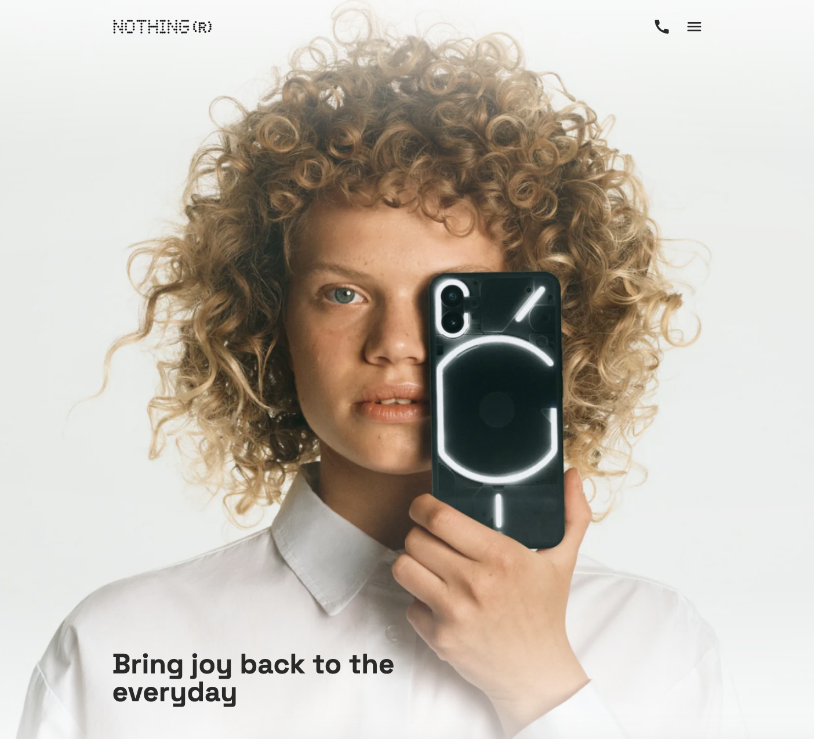

# Nothing Landing Page

A responsive landing page for Nothing products implemented using HTML, SCSS, and JavaScript.

## Project Overview

This project is a pixel-perfect implementation of the Nothing landing page design. The page showcases Nothing's product lineup including phones and audio devices in a modern, clean interface.

## Features

- Responsive design that works across mobile, tablet, and desktop devices
- Interactive menu navigation
- Product showcase sections
- Category browsing
- Clean, minimal aesthetic matching Nothing's brand identity

## Technologies Used

- HTML5
- SCSS for styling
- JavaScript for interactivity
- BEM methodology for CSS class naming
- Responsive design principles

## Project Structure

- `src/` - Source files
  - `index.html` - Main HTML document
  - `styles/` - SCSS stylesheets
  - `scripts/` - JavaScript files
  - `images/` - Image assets

## Development

To run this project locally:

1. Clone the repository
2. Install dependencies with `npm install`
3. Run the development server with `npm start`

## Deployment

The site is deployed at: [DEMO LINK](https://igor-romasiuk.github.io/layout_landing-page/)
